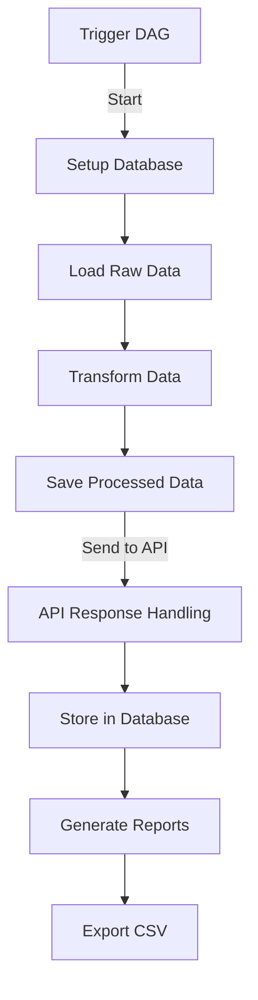
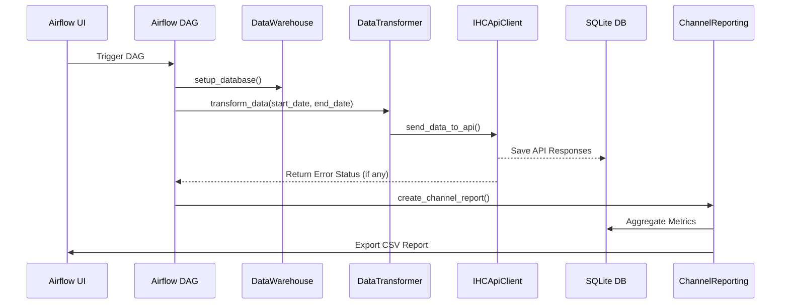

---

# **Airflow ETL Pipeline** 🚀

📊 **Automated ETL pipeline using Apache Airflow for data extraction, transformation, and reporting.**

  

---

## 📌 **Table of Contents**

- [🔹 Features](#-features)
- [🏗️ Architecture](#️-architecture)
- [⚙️ Installation](#️-installation)
- [🚀 Usage](#-usage)
- [🔄 Workflow](#-workflow)
- [🛠️ Customization](#️-customization)
- [📈 Logging & Monitoring](#-logging--monitoring)
- [🚀 Future Enhancements](#-future-enhancements)
- [📜 License](#-license)
- [👤 Author](#-author)

---

## 🔹 **Features**

✔ **Automated DAG Execution** via Apache Airflow  
✔ **Database Setup** and schema verification  
✔ **Data Transformation & Processing**  
✔ **API Integration** for external data transmission  
✔ **Error Handling & Status Updates**  
✔ **Attribution & Reporting** in CSV format  

---

## 🏗️ **Architecture**

The ETL pipeline follows a modular architecture, divided into **distinct components**:



📌 **Main Components:**  
🔹 **Airflow DAG** → Manages task execution  
🔹 **DataWarehouse** → Stores raw & processed data  
🔹 **DataTransformer** → Processes and transforms data  
🔹 **IHCApiClient** → Sends data to API  
🔹 **DataLoader** → Loads data into warehouse  
🔹 **ChannelReporting** → Aggregates reporting metrics  
🔹 **SQLite DB** → Stores final transformed data  

---

## ⚙️ **Installation**

### **Prerequisites**
✔ Python 3.x  
✔ Apache Airflow  
✔ SQLite (or PostgreSQL, MySQL)  
✔ Required Python libraries (see `requirements.txt`)  

## **Databse Files**
To get the necessary database files, download them from the original source:
[Recruitment Challenge - Data Engineering](https://github.com/haensel-ams/recruitment_challenge/tree/master/Data_Engineering_202309).


### **Setup Instructions**
```sh
# Clone repository
git clone https://github.com/yourusername/airflow-etl-pipeline.git
cd airflow-etl-pipeline

# Install dependencies
pip install -r requirements.txt

# Initialize Airflow
airflow db init
airflow users create --username admin --firstname John --lastname Doe --role Admin --email admin@example.com

# Start Airflow services
airflow scheduler &
airflow webserver --port 8080
```
📌 **Access Airflow UI:** `http://localhost:8080`

---

## 🚀 **Usage**

1. **Trigger DAG** manually or schedule periodic execution.  
2. **Monitor Airflow UI** for DAG execution progress.  
3. **Check SQLite Database** for processed data.  
4. **Export & Analyze CSV Reports** generated in the pipeline.  

---

## 🔄 **Workflow Overview**



---

## 🛠️ **Customization**

📌 **Modify ETL Logic:**  
🔹 Adjust transformations in `data_transformer.py`  
🔹 Change API configurations in `ihc_api_client.py`  
🔹 Update report structure in `channel_reporting.py`  
🔹 Edit DAG schedules in `dags/etl_pipeline.py`  

---

## 📈 **Logging & Monitoring**

🔍 **Airflow Logs:** Located in `~/airflow/logs/`  
🛠️ **Debugging Commands:**
```sh
airflow tasks logs <dag_id> <task_id>
```
📊 **Monitor API Requests:**  
🔹 Logs saved in `ihc_api_client.py`  

---

## 🚀 **Future Enhancements**

✨ **Upgrade to PostgreSQL or MySQL**  
✨ **Enhance Data Validation & Integrity Checks**  
✨ **Implement Real-Time Monitoring Dashboards**  
✨ **Optimize API Integration for Scalability**  

